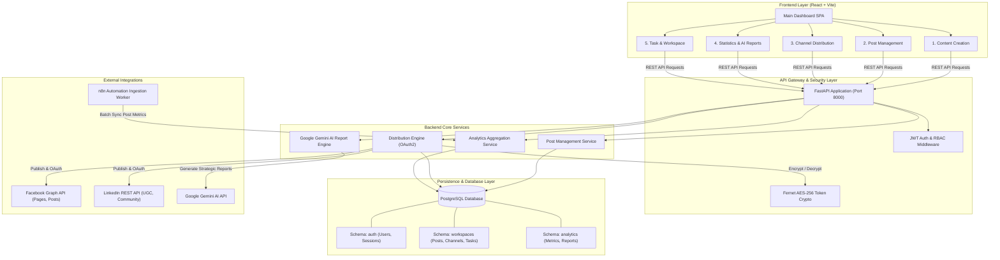
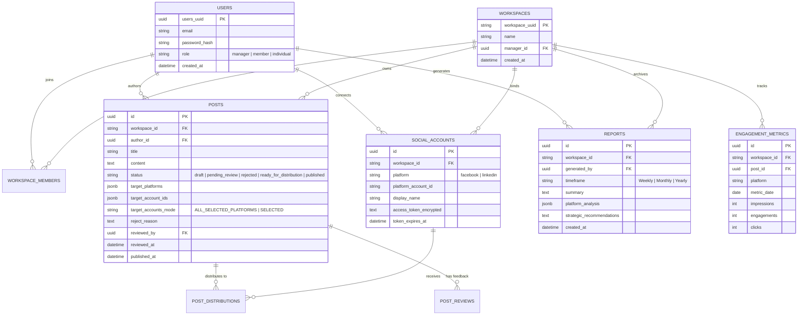

# 🌐 TỔNG QUAN TOÀN BỘ HỆ THỐNG (SYSTEM OVERALL ARCHITECTURE)
## SOCIAL MEDIA MANAGEMENT & MULTI-CHANNEL DISTRIBUTION PLATFORM

---

## 📖 1. GIỚI THIỆU TỔNG QUAN (INTRODUCTION)
Hệ thống là một nền tảng quản lý mạng xã hội tập trung (**Social Media Management Platform**), cho phép các cá nhân (**Individual**) và tổ chức doanh nghiệp (**Business / Team**) tạo nội dung, lên lịch, xét duyệt phân quyền (RBAC), xuất bản đa nền tảng (**Facebook, LinkedIn**,...) và theo dõi phân tích tương tác tự động thông qua **AI & Automation (n8n)**.

---

## 🏗️ 2. KIẾN TRÚC TỔNG THỂ HỆ THỐNG (SYSTEM ARCHITECTURE)



---

## 🧩 3. CÁC MODULE CHỨC NĂNG CHÍNH (CORE FUNCTIONAL MODULES)

### 1️⃣ Module Xác thực & Không gian làm việc (Authentication & Workspace)
* **Phân quyền người dùng (RBAC)**:
  * 👑 **Manager (Quản lý)**: Toàn quyền duyệt bài (`Approve & Publish`), từ chối bài kèm lý do (`Reject with feedback`), kết nối kênh phân phối (`Distribution`), quản lý thành viên và xuất báo cáo.
  * 👤 **Member (Thành viên)**: Tạo bài viết (`Submit for review`), lưu nháp (`Save as Draft`), xem phản hồi bài bị từ chối (`Rejected Comments`), quản lý bài viết cá nhân.
  * 🚀 **Individual (Cá nhân độc lập)**: Không gian làm việc đơn, xuất bản bài viết trực tiếp không qua quy trình phê duyệt nhóm.
* **Bảo mật**: Mã hóa mật khẩu an toàn với thuật toán `bcrypt`, cấp phát phiên làm việc qua `JWT Access Token`.

---

### 2️⃣ Module Sáng tạo nội dung (Content Module - `Contmodule.jsx`)
* **Trình tạo nội dung thông minh**: Hỗ trợ viết bài kèm đính kèm Prompt Template, kho tri thức (Knowledge Base) và bộ từ khóa SEO / Hashtags.
* **Lựa chọn nền tảng đích linh hoạt (`Target Platforms`)**:
  * Tích chọn linh hoạt Facebook, LinkedIn hoặc cả hai.
  * Hệ thống lưu trữ mảng `target_platforms` trong cơ sở dữ liệu làm căn cứ kiểm soát phân phối.
* **2 Luồng lưu trữ rõ ràng**:
  * 🟠 **Submit**: Gửi bài viết sang trạng thái **`Pending`** (`pending_review`) chờ Manager duyệt.
  * ⚪ **Save as Draft**: Lưu bài viết ở trạng thái **`Drafts`** (`draft`) để tiếp tục chỉnh sửa.

---

### 3️⃣ Module Quản lý bài đăng (Post Management - `PMmodule.jsx`)
* **Bộ chọn tài khoản phân cấp thông minh (`TargetAccountSelector.jsx`)**:
  * **Strict Scoping**: Chỉ hiển thị các tài khoản thuộc những nền tảng đã được tích chọn trong `Target Platforms` (loại bỏ hoàn toàn tài khoản ngoài phạm vi).
  * **Tính năng chuyên sâu**: Ô tìm kiếm tài khoản thời gian thực (Search), nút chọn tất cả *"All Accounts on Selected Platforms"*, phân nhóm tài khoản theo từng Platform kèm số lượng (`Facebook (2/2)`, `LinkedIn (4/10)`), hỗ trợ mở rộng không giới hạn (Scalable).
  * **Tự động làm sạch**: Khi Manager bỏ chọn 1 Platform, các tài khoản thuộc platform đó sẽ tự động bị loại bỏ ngay lập tức.
* **Quy trình Duyệt & Từ chối bài viết chuyên nghiệp**:
  * 🟢 **Approve & Publish**: Xuất bản bài viết đồng thời đến toàn bộ danh sách tài khoản đã chọn. Sau khi đăng, hiển thị trực tiếp đường dẫn bài đăng thật (`View Post ↗` trên Facebook & LinkedIn).
  * 🔴 **Reject with Feedback**: Mặc định ẩn ô nhập lý do. Khi bấm **Reject**, hiển thị khung nhập lý do từ chối, gửi API `PATCH` lưu trạng thái `rejected` và `reject_reason` xuống CSDL để Member xem được đầy đủ lý do trong tab **Rejected**.
  * ✏️ **Edit & Delete**: Chỉnh sửa bản nháp hoặc xóa bài viết trực quan.

---

### 4️⃣ Module Kênh phân phối (Distribution Module - `Dismodule.jsx` & `service.py`)
* **Kết nối đa kênh qua chuẩn OAuth 2.0**:
  * **Facebook Page**: Tích hợp Facebook Graph API (`pages_manage_posts`, `pages_read_engagement`).
  * **LinkedIn Profile & Page**: Tích hợp LinkedIn OAuth 2.0 (`w_member_social`, `r_liteprofile`).
* **Bảo mật mã hóa Token lưu trữ (Data at Rest)**:
  * Toàn bộ `access_token` và `refresh_token` được mã hóa đối xứng bằng thuật toán chuẩn quân đội **AES-256 (Fernet)** trước khi lưu vào CSDL PostgreSQL.
* **Cơ chế an toàn (Conflict Guard)**:
  * Ngăn chặn xóa kênh phân phối (`HTTP 409 Conflict`) nếu kênh đó đang có bài viết ở trạng thái chờ duyệt hoặc đang xuất bản.

---

### 5️⃣ Module Thống kê & Báo cáo AI (Statistics Module - `Stamodule.jsx` & `ai_engine.py`)
* **Trực quan hóa chỉ số tương tác (Interactive Visualizations)**:
  * 📈 **MultiLine Time-series Chart**: Thống kê tương tác theo các mốc `Weekly`, `Monthly`, `Yearly` (phân loại theo Facebook và LinkedIn).
  * 🍩 **Doughnut Market Share**: Tỷ lệ thị phần tương tác giữa các nền tảng (Facebook 75% vs LinkedIn 25%).
  * ⚡ **Today Card**: Cập nhật số lượng tương tác phát sinh trong ngày theo vai trò người dùng.
  * 🏆 **Top 7 Engaging Posts**: Danh sách 7 bài viết có lượng tương tác cao nhất hệ thống.
* **AI Strategic Report Engine (Google Gemini)**:
  * Tự động phân tích sâu bức tranh dữ liệu, phát hiện xu hướng nội dung thịnh hành và đề xuất giải pháp tối ưu hóa tương tác.
  * Tích hợp cơ chế **Resilient Offline Fallback** (`RuleBasedReportProvider`) đảm bảo hệ thống không bao giờ bị lỗi khi mất kết nối Internet hoặc lỗi API Key.
  * Cho phép lưu báo cáo vào lịch sử CSDL và tải về máy dưới dạng tài liệu hoàn chỉnh.

---

### 6️⃣ Tự động hóa đồng bộ dữ liệu với n8n (Automation Workflow)
* **Cronjob định kỳ**: n8n Workflow tự động gọi API Facebook & LinkedIn theo lịch trình để lấy các chỉ số tương tác mới nhất (Likes, Shares, Comments, Impressions).
* **Batch Ingestion**: Đẩy toàn bộ dữ liệu thô về endpoint `POST /api/v1/analytics/ingest` để lưu trữ và tổng hợp tự động vào bảng `EngagementMetric`.

---

## 🗄️ 4. SƠ ĐỒ THỰC THỂ CƠ SỞ DỮ LIỆU (DATABASE ERD)



---

## 📁 5. CẤU TRÚC THƯ MỤC DỰ ÁN (PROJECT DIRECTORY TREE)

```text
Software_Project_Hcmus/
├── adjust_ui.md                          # Nhật ký chi tiết mọi thay đổi UI & lý do
├── System_Overall.md                     # Tài liệu tổng quan toàn bộ hệ thống
├── src/
│   ├── backend/                          # Backend FastAPI (Python 3.11+)
│   │   ├── app/
│   │   │   ├── analytics/                # Module Thống kê & Báo cáo AI
│   │   │   │   ├── ai_engine.py          # Google Gemini AI & Rule-based fallback
│   │   │   │   ├── ingest_router.py      # Cổng nhận dữ liệu tự động từ n8n
│   │   │   │   ├── models.py             # CSDL Models cho Analytics & Reports
│   │   │   │   ├── router.py             # REST API Endpoints thống kê & báo cáo
│   │   │   │   ├── schemas.py            # Pydantic Schemas cho Analytics
│   │   │   │   └── service.py            # Business logic tính toán chỉ số
│   │   │   ├── distribution/             # Module Kênh phân phối & Đăng bài
│   │   │   │   ├── crypto.py             # Mã hóa Fernet AES-256 Token
│   │   │   │   ├── repository.py         # Truy vấn CSDL kênh phân phối
│   │   │   │   ├── router.py             # REST API OAuth2 & Publish Endpoints
│   │   │   │   ├── schemas.py            # Pydantic Schemas Distribution
│   │   │   │   └── service.py            # Facebook Graph API & LinkedIn REST API
│   │   │   ├── routers/                  # Các Router chính (Auth, Posts, Workspaces)
│   │   │   │   ├── auth.py
│   │   │   │   ├── posts.py
│   │   │   │   └── workspaces.py
│   │   │   ├── config.py                 # Đọc biến môi trường (.env)
│   │   │   ├── crud.py                   # Các hàm thao tác CSDL PostgreSQL
│   │   │   ├── database.py               # Kết nối SQLAlchemy Engine & Session
│   │   │   ├── dependencies.py           # Dependency Injection & Token Auth
│   │   │   ├── main.py                   # Điểm khởi tạo FastAPI App chính
│   │   │   ├── models.py                 # SQLAlchemy Core Models (User, Post, Workspace)
│   │   │   └── schemas.py                # Core Pydantic Schemas
│   │   ├── database/
│   │   │   └── file_database.sql         # Script khởi tạo cấu trúc CSDL PostgreSQL
│   │   ├── test_analytics.py             # Test suite tự động Module Statistics (7 TCs)
│   │   ├── test_distribution.py          # Test suite tự động Module Distribution (8 TCs)
│   │   └── requirements.txt              # Danh sách thư viện Python
│   │
│   └── frontend/                         # Frontend React + Vite SPA
│       ├── src/
│       │   ├── component/                # Các Module giao diện chính
│       │   │   ├── Contmodule.jsx        # 1. Module Soạn thảo nội dung
│       │   │   ├── PMmodule.jsx          # 2. Module Quản lý & Phê duyệt bài đăng
│       │   │   ├── Dismodule.jsx         # 3. Module Kết nối kênh phân phối
│       │   │   ├── Stamodule.jsx         # 4. Module Thống kê & Báo cáo AI
│       │   │   ├── TargetAccountSelector.jsx # Bộ chọn tài khoản phân cấp đa nền tảng
│       │   │   ├── Taskmodule.jsx        # 5. Module Giao việc (Task Board)
│       │   │   ├── WSinfomodule.jsx      # Quản lý thành viên Workspace
│       │   │   └── Settingsmodule.jsx    # Cài đặt tài khoản & cấu hình
│       │   ├── page/
│       │   │   ├── MainDashboard.jsx     # Trang Dashboard điều hướng chính
│       │   │   └── Signin_Signup.jsx     # Trang Đăng nhập / Đăng ký
│       │   ├── App.jsx                   # Component Root & Toast Provider
│       │   └── index.css                 # Design Tokens, Font Satoshi, Animations
│       └── package.json                  # Cấu hình thư viện Vite, React, Lucide
```

---

## 🛠️ 6. HƯỚNG DẪN KHỞI CHẠY HỆ THỐNG (LOCAL RUN GUIDE)

### Bước 1: Khởi động Backend (FastAPI)
```bash
cd src/backend
# Kích hoạt môi trường ảo
.venv\Scripts\activate
# Chạy server FastAPI với Live Reload
uvicorn app.main:app --reload --host 127.0.0.1 --port 8000
```
* Swagger API Documentation: `http://localhost:8000/docs`

### Bước 2: Khởi động Frontend (React + Vite)
```bash
cd src/frontend
npm run dev
```
* Ứng dụng chạy tại: `http://localhost:5173`

### Bước 3: Chạy toàn bộ Test Suites tự động
```bash
cd src/backend
.venv\Scripts\python.exe test_distribution.py
.venv\Scripts\python.exe test_analytics.py
```
*(Kết quả: 15/15 test cases PASS 100% 👍)*

---

## 🏆 7. TIÊU CHUẨN THIẾT KẾ VÀ ĐẶC ĐIỂM NỔI BẬT (HIGHLIGHTS)
1. **Tuân thủ quy tắc UI Design Tokens**: Toàn bộ giao diện sử dụng font chữ cao cấp **Satoshi**, bảng màu tối ưu (Primary Orange `#FE7216`, Success Green `#22c55e`, Alert Red `#ef4444`), micro-animations và hiệu ứng hover mượt mà.
2. **Khả năng mở rộng không giới hạn (Future-proof)**: Thiết kế trừu tượng hóa cho phép tích hợp thêm các mạng xã hội mới (Instagram, TikTok, X, YouTube, Threads,...) mà không phải thay đổi cấu trúc cốt lõi.
3. **Bảo mật tuyệt đối**: Token mã hóa đối xứng cấp độ ngân hàng, kiểm soát chéo phân quyền (RBAC) nghiêm ngặt tại mọi tầng API.
