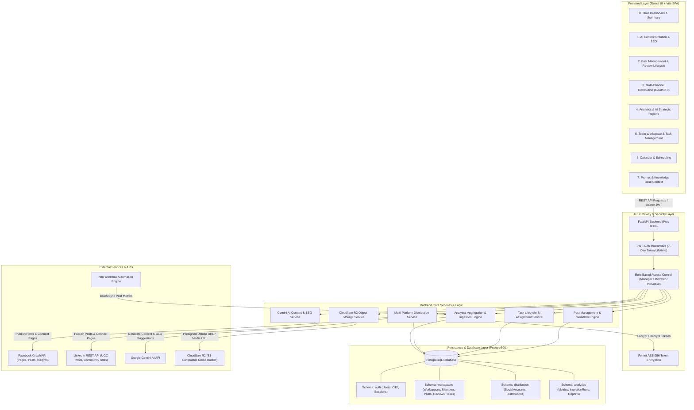
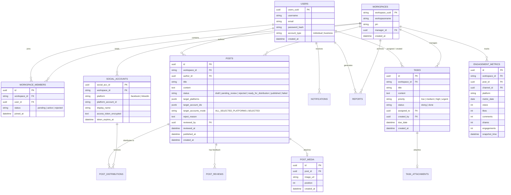

# 🌐 TỔNG QUAN TOÀN BỘ HỆ THỐNG (SYSTEM OVERALL ARCHITECTURE)
## SOCIAL MEDIA MANAGEMENT & MULTI-CHANNEL DISTRIBUTION PLATFORM (OMNI PLATFORMS)

---

## 📖 1. GIỚI THIỆU TỔNG QUAN (INTRODUCTION)
**Omni Platforms** là hệ thống quản trị và phân phối nội dung mạng xã hội tập trung (**Social Media Management & Distribution Platform**) dành cho cả người dùng cá nhân (**Individual**) và tổ chức doanh nghiệp (**Business / Team Workspace**). 

Hệ thống tích hợp trí tuệ nhân tạo **Google Gemini AI**, lưu trữ đám mây **Cloudflare R2**, tự động hóa **n8n**, cùng cơ chế phân quyền kiểm duyệt chặt chẽ (**RBAC**) để hỗ trợ toàn diện chu trình sống của nội dung số: từ khâu sáng tạo nội dung, tối ưu SEO, phân công công việc, phê duyệt đa cấp, xuất bản đồng thời lên **Facebook Page & LinkedIn**, đến theo dõi phân tích tương tác theo thời gian thực.

---

## 🏗️ 2. KIẾN TRÚC TỔNG THỂ HỆ THỐNG (SYSTEM ARCHITECTURE)



---

## 🧩 3. CHI TIẾT CÁC MODULE CHỨC NĂNG (CORE FUNCTIONAL MODULES)

### 1️⃣ Module Xác thực & Quản trị Workspace (Authentication & Team Workspace)
* **Xác thực an toàn (OTP & JWT)**:
  * Đăng ký tài khoản qua quy trình xác minh mã OTP 6 số gửi về Email (`smtp.gmail.com`).
  * Cấp phát `JWT Access Token` với thời hạn bảo mật 7 ngày (10.080 phút), hỗ trợ tự động xác thực phiên qua `/auth/me`.
* **Phân quyền người dùng (Role-Based Access Control - RBAC)**:
  * 👑 **Manager (Quản lý Workspace)**:
    * Quản lý thành viên (Duyệt yêu cầu tham gia, Kick out thành viên).
    * Giao việc (Tạo Task, gán deadline, mức độ ưu tiên, tệp đính kèm).
    * Xóa Task (`🗑 Delete`) kèm hộp thoại xác nhận.
    * Duyệt bài viết (`Approve & Publish`) hoặc Từ chối (`Reject with Feedback`).
    * Quản lý kết nối kênh phân phối (`Distribution`) và xuất báo cáo chiến lược.
  * 👤 **Member (Thành viên Workspace)**:
    * Nhận Task được giao ở trạng thái **`Doing`**, chuyển trạng thái sang **`✓ Done`** khi hoàn thành (không có quyền xóa Task).
    * Sáng tạo nội dung và nộp duyệt bài viết (`Submit for review`) hoặc lưu nháp cá nhân (`Save as Draft`).
    * Xem phản hồi bài viết bị từ chối và chỉnh sửa lại.
  * 🚀 **Individual (Tài khoản Cá nhân)**:
    * Không gian làm việc độc lập, xuất bản bài viết trực tiếp không qua quy trình kiểm duyệt nhóm.

---

### 2️⃣ Module Sáng tạo nội dung AI & SEO (Our Content - `Contmodule.jsx`)
* **Tạo nội dung thông minh với Google Gemini AI**:
  * Nhập ý tưởng/chủ đề hoặc chọn Prompt Template & Knowledge Base doanh nghiệp.
  * Bấm **`✨ Generate with AI`** để tạo bài viết có bố cục chuyên nghiệp, phù hợp với tone giọng mạng xã hội.
* **Tối ưu SEO & Hashtags tự động**:
  * Tự động trích xuất bộ từ khóa SEO cốt lõi và danh sách Hashtags chuẩn xu hướng (`#Trending`).
* **Quản lý đa phương tiện (Cloudflare R2 Media)**:
  * Tải ảnh trực tiếp lên Cloudflare R2 qua Presigned URL bảo mật, tự động liên kết với bài viết (`PostMedia`).
* **Lựa chọn nền tảng & Luồng nộp bài thông minh**:
  * Tích chọn linh hoạt Facebook, LinkedIn.
  * **Manager / Individual**: Bấm **Submit** ➔ Đăng ngay và chuyển sang `Published`.
  * **Member**: Bấm **Submit** ➔ Gửi yêu cầu duyệt sang trạng thái `Pending` (`pending_review`).
  * Cả hai vai trò đều có nút **Save as Draft** để lưu bản nháp vào `Drafts`.

---

### 3️⃣ Module Quản lý vòng đời bài viết (Post Management - `PMmodule.jsx`)
* **Quản lý trạng thái bài viết phân tầng**:
  * 📑 **All Posts**: Toàn bộ bài viết trong hệ thống/workspace.
  * 📝 **Drafts**: Bài viết đang soạn thảo, lưu tạm.
  * ⏳ **Pending**: Bài viết Member đã nộp, chờ Manager duyệt.
  * ❌ **Rejected**: Bài viết bị từ chối kèm nhận xét chỉnh sửa từ Manager.
  * 🚀 **Published**: Bài viết đã xuất bản thành công trên Facebook/LinkedIn kèm liên kết bài viết thực tế (`Live Post ↗`).
  * ⚠️ **Failed**: Bài viết gặp lỗi phân phối (hỗ trợ thử lại).
* **Bộ chọn tài khoản phân cấp (`TargetAccountSelector.jsx`)**:
  * **Strict Scoping**: Chỉ hiển thị các tài khoản thuộc những nền tảng đã được tích chọn trong bài viết.
  * Tích hợp tìm kiếm tài khoản thời gian thực, chọn nhanh tất cả hoặc chọn từng Fanpage/Profile cụ thể.
* **Quy trình Phê duyệt & Nhận xét (Approval Workflow)**:
  * **Approve & Publish**: Phân phối trực tiếp bài viết đến tất cả tài khoản đã chọn và cập nhật trạng thái `Published`.
  * **Reject with Feedback**: Mở khung phản hồi, nhập lý do từ chối gửi về cho Member để hoàn thiện lại nội dung.

---

### 4️⃣ Module Phân công & Quản trị công việc (Task Management)
* **Quy trình vòng đời công việc**:
  * Khi Manager giao việc ➔ Trạng thái mặc định: **`Doing`** (Badge xanh dương).
  * Khi Member hoàn thành công việc ➔ Bấm nút **`✓ Done`** ➔ Trạng thái chuyển sang **`Done`** (Badge xanh lá).
* **Phân quyền thao tác**:
  * **Manager**: Tạo việc, xem toàn bộ danh sách, có nút **`🗑 Delete`** để xóa công việc.
  * **Member**: Không có quyền xóa Task (Backend chặn `403 Forbidden`), chỉ có nút thao tác **`✓ Done`**.
* **Cửa sổ `See all >` toàn diện**:
  * Hiển thị bảng chi tiết công việc với thanh tìm kiếm nhanh theo tiêu đề, trạng thái, người được giao.
  * Tải xuống tệp tài liệu đính kèm (`Attachment Download ↗`) và thao tác trực tiếp.

---

### 5️⃣ Module Kênh phân phối mạng xã hội (Distribution - `Dismodule.jsx`)
* **Kết nối chuẩn OAuth 2.0**:
  * **Facebook Page**: Tích hợp Facebook Graph API (`pages_manage_posts`, `pages_read_engagement`).
  * **LinkedIn Profile / Company Page**: Tích hợp LinkedIn OAuth 2.0 (`w_member_social`, `r_liteprofile`).
* **Bảo mật mã hóa Token lưu trữ**:
  * Toàn bộ token xác thực được mã hóa đối xứng **AES-256 (Fernet)** trước khi lưu vào CSDL PostgreSQL.
* **Cơ chế an toàn (Conflict Guard)**:
  * Chặn xóa kênh phân phối nếu kênh đó đang có bài viết chờ xuất bản (`HTTP 409 Conflict`).

---

### 6️⃣ Module Thống kê & Báo cáo chiến lược AI (Statistics - `Stamodule.jsx`)
* **Trực quan hóa chỉ số tương tác**:
  * 📈 **Time-Series Chart**: Tương tác theo tuần, tháng, năm (phân tách Facebook vs LinkedIn).
  * 🍩 **Market Share Chart**: Tỷ lệ đóng góp tương tác giữa các nền tảng.
  * ⚡ **Today Card & Top 7 Posts**: Chỉ số tức thời trong ngày và 7 bài viết viral nhất.
* **Tự động hóa với n8n & Gemini AI Report**:
  * n8n Workflow định kỳ thu thập chỉ số (Likes, Comments, Shares, Impressions) đẩy về endpoint `/api/v1/analytics/ingest`.
  * Google Gemini AI phân tích dữ liệu, tự động tạo báo cáo chiến lược phát triển nội dung kèm cơ chế **Offline Fallback** không bao giờ sập.

---

## 🗄️ 4. SƠ ĐỒ CƠ SỞ DỮ LIỆU TOÀN DIỆN (DATABASE ERD)



---

## 📁 5. CẤU TRÚC THƯ MỤC DỰ ÁN (PROJECT DIRECTORY STRUCTURE)

```text
Software_Project_Hcmus/
├── docker-compose.yml                    # Container hóa n8n automation
├── adjust_ui.md                          # Nhật ký thay đổi UI & lý do chi tiết (61 mục)
├── Feature_New_Update.md                 # Tài liệu tính năng cập nhật mới nhất
├── System_Overall.md                     # Tài liệu tổng quan kiến trúc hệ thống
├── n8n/                                  # Workflows tự động hóa đồng bộ chỉ số MXH
│   ├── README.md
│   └── workflows/
│       ├── 01_main_scheduler.json
│       ├── 02_facebook_sync.json
│       ├── 03_linkedin_sync.json
│       └── 04_manual_sync_webhook.json
├── src/
│   ├── backend/                          # Backend FastAPI (Python 3.11+)
│   │   ├── app/
│   │   │   ├── analytics/                # Module Thống kê & Báo cáo AI (Gemini)
│   │   │   ├── distribution/             # Module Phân phối Facebook & LinkedIn
│   │   │   ├── routers/                  # API Routers (Auth, Posts, Workspaces, Calendar)
│   │   │   ├── services/                 # AI Content & SEO Generation Services
│   │   │   ├── config.py                 # Cấu hình biến môi trường & JWT 7 ngày
│   │   │   ├── crud.py                   # Business Logic & Truy vấn cơ sở dữ liệu
│   │   │   ├── database.py               # Kết nối PostgreSQL SQLAlchemy Engine
│   │   │   ├── dependencies.py           # Dependency Injection & Token RBAC
│   │   │   ├── models.py                 # SQLAlchemy Database Models
│   │   │   ├── r2.py                     # Cloudflare R2 Object Storage Integration
│   │   │   ├── schemas.py                # Pydantic Request & Response Schemas
│   │   │   └── security.py               # Mã hóa mật khẩu Argon2 & JWT
│   │   ├── test_distribution.py          # Unit & Integration tests cho Distribution
│   │   └── test_analytics.py             # Unit & Integration tests cho Analytics & Ingestion
│   └── frontend/                         # Frontend React 18 + Vite SPA
│       ├── src/
│       │   ├── component/
│       │   │   ├── DBultils/             # Các Widgets Dashboard (AssignedTaskList, Stats)
│       │   │   ├── Calenmodule.jsx       # Giao diện Lịch & Kế hoạch nội dung
│       │   │   ├── Contmodule.jsx        # Giao diện Sáng tạo nội dung & AI/SEO
│       │   │   ├── Dismodule.jsx         # Giao diện Kết nối Kênh phân phối OAuth
│       │   │   ├── PMmodule.jsx          # Giao diện Quản lý Bài viết & Phê duyệt
│       │   │   ├── Stamodule.jsx         # Giao diện Thống kê & Báo cáo chiến lược
│       │   │   ├── WSmodule.jsx          # Giao diện Không gian làm việc nhóm & Task
│       │   │   ├── P&Cmodule.jsx         # Giao diện Quản lý Prompt & Knowledge Base
│       │   │   └── TargetAccountSelector.jsx # Bộ chọn tài khoản đích đa kênh
│       │   ├── page/
│       │   │   ├── MainDashboard.jsx     # Trang Dashboard điều hướng chính
│       │   │   ├── SignIn.jsx            # Trang Đăng nhập
│       │   │   └── SignUp.jsx            # Trang Đăng ký & OTP Verification
│       │   ├── App.jsx                   # Root Component & Toaster Provider
│       │   └── index.css                 # Hệ thống Design Tokens & Font Satoshi
│       └── package.json                  # Cấu hình thư viện Vite, React, Hot-toast
```

---

## 🛠️ 6. HƯỚNG DẪN KHỞI CHẠY HỆ THỐNG (RUN GUIDE)

### Bước 1: Khởi động Backend (FastAPI)
```bash
cd src/backend
# Kích hoạt virtualenv
.\.venv\Scripts\activate
# Khởi chạy server FastAPI
uvicorn app.main:app --reload --host 127.0.0.1 --port 8000
```
* **Swagger API Docs**: `http://localhost:8000/docs`

### Bước 2: Khởi động Frontend (React + Vite)
```bash
cd src/frontend
npm run dev
```
* **Giao diện Web**: `http://localhost:5173`

### Bước 3: Kiểm tra Build & Chạy Test Suites
```bash
# Kiểm tra build frontend
cd src/frontend && npm run build

# Chạy test backend
cd src/backend && .\.venv\Scripts\python.exe test_distribution.py
```

---

## 🏆 7. ĐẶC ĐIỂM NỔI BẬT & ĐIỂM CỘNG DỰ ÁN (KEY HIGHLIGHTS)
1. **Thiết kế giao diện hiện đại (UI Excellence)**: Chuẩn thẩm mỹ cao cấp với font chữ **Satoshi**, hiệu ứng kính mờ (Glassmorphism), bảng màu hài hòa (Orange `#FE7216`, Success Green, Slate Blue) và vi tương tác mượt mà.
2. **Kiểm soát phân quyền chặt chẽ (RBAC)**: Phân tách rõ ràng quyền hạn giữa Manager, Member và Individual ở cả tầng giao diện lẫn backend middleware.
3. **Khả năng tích hợp mở rộng cao (Scalable Architecture)**: Thiết kế mô-đun hóa cho phép dễ dàng tích hợp thêm mạng xã hội mới (Instagram, TikTok, YouTube, Threads) và công cụ AI khác.
4. **Bảo mật cấp cao**: Mã hóa khóa kết nối AES-256 Fernet, mã hóa mật khẩu Argon2, xác thực OTP và JWT Token 7 ngày.
