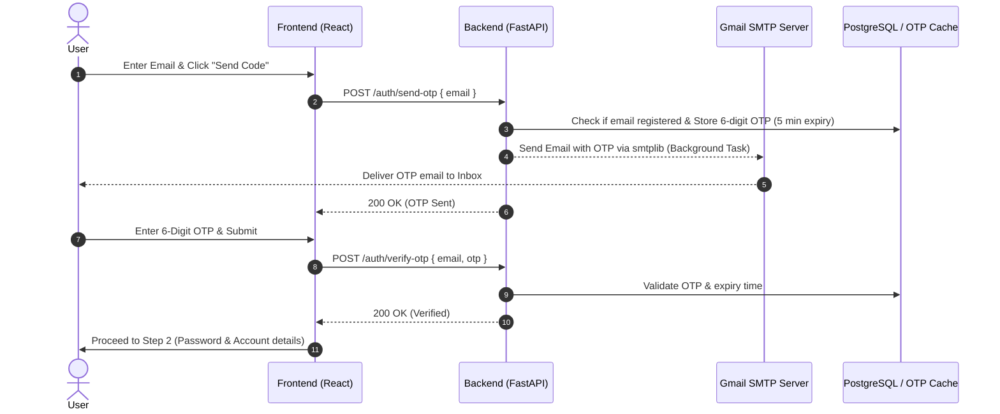

# Implementation Plan: Gmail Email Verification (OTP) Integration

This plan outlines how to implement a 2-step Email Verification system using **Gmail SMTP** and **6-digit OTP codes** for the registration flow.

## 🎯 Architecture Overview



---

## 🔑 Setup Prerequisites (Gmail App Password)

To allow the Backend to send emails via Gmail, a **Google App Password** is required:
1. Go to [Google Account Security](https://myaccount.google.com/security).
2. Enable **2-Step Verification** (if not already enabled).
3. Search for **App passwords** in the search bar.
4. Create a new App Password named `Omni Platforms Backend`.
5. Copy the generated 16-character password into `.env`.

---

## 🛠️ Proposed Changes

### Configuration & Environment

#### [MODIFY] [.env.example](file:///d:/Study_Work/Hcmus/Nhập%20môn%20công%20nghệ%20phần%20mềm%20-%2024C08/Software_Project_Hcmus/src/backend/.env.example) & [.env](file:///d:/Study_Work/Hcmus/Nhập%20môn%20công%20nghệ%20phần%20mềm%20-%2024C08/Software_Project_Hcmus/src/backend/.env)
- Add SMTP settings:
  ```env
  SMTP_SERVER=smtp.gmail.com
  SMTP_PORT=587
  SMTP_USERNAME=your_gmail_address@gmail.com
  SMTP_PASSWORD=your_16_char_app_password
  EMAIL_FROM=your_gmail_address@gmail.com
  ```

#### [MODIFY] [config.py](file:///d:/Study_Work/Hcmus/Nhập%20môn%20công%20nghệ%20phần%20mềm%20-%2024C08/Software_Project_Hcmus/src/backend/app/config.py)
- Add pydantic settings fields for SMTP configurations (`smtp_server`, `smtp_port`, `smtp_username`, `smtp_password`, `email_from`).

---

### Backend Service & Endpoints

#### [NEW] [email_service.py](file:///d:/Study_Work/Hcmus/Nhập%20môn%20công%20nghệ%20phần%20mềm%20-%2024C08/Software_Project_Hcmus/src/backend/app/email_service.py)
- Implement `send_otp_email(to_email: str, otp_code: str)` using Python's standard `smtplib` and `email.message.EmailMessage` over TLS on port 587.

#### [NEW / MODIFY] OTP Storage & Validation in [crud.py](file:///d:/Study_Work/Hcmus/Nhập%20môn%20công%20nghệ%20phần%20mềm%20-%2024C08/Software_Project_Hcmus/src/backend/app/crud.py) or Memory Store
- Create simple in-memory OTP cache or DB table `email_verifications` storing `(email, otp_code, expires_at, is_verified)`.

#### [MODIFY] [schemas.py](file:///d:/Study_Work/Hcmus/Nhập%20môn%20công%20nghệ%20phần%20mềm%20-%2024C08/Software_Project_Hcmus/src/backend/app/schemas.py)
- Add schemas: `SendOTPRequest`, `VerifyOTPRequest`, `OTPResponse`.

#### [MODIFY] [auth.py](file:///d:/Study_Work/Hcmus/Nhập%20môn%20công%20nghệ%20phần%20mềm%20-%2024C08/Software_Project_Hcmus/src/backend/app/routers/auth.py)
- Add endpoints:
  - `POST /auth/send-otp`: Sends 6-digit OTP using FastAPI `BackgroundTasks`.
  - `POST /auth/verify-otp`: Validates the 6-digit OTP.

---

### Frontend Integration

#### [MODIFY] [SignUp.jsx](file:///d:/Study_Work/Hcmus/Nhập%20môn%20công%20nghệ%20phần%20mềm%20-%2024C08/Software_Project_Hcmus/src/frontend/src/page/SignUp.jsx)
- Update SignUp component to support 2-Step Registration UI:
  - **Step 1**: Enter Email $\rightarrow$ Click `Send Code` $\rightarrow$ Input 6-digit OTP $\rightarrow$ Click `Verify`.
  - **Step 2**: Enter Username, Password, and Workspace details after email is verified.

---

## 🧪 Verification Plan

### Automated / API Verification
- Execute Python test script sending a real OTP email via Gmail SMTP:
  ```bash
  py -3.12 -c "from app.email_service import send_otp_email; send_otp_email('test@gmail.com', '123456')"
  ```
- Test `POST /auth/send-otp` and `POST /auth/verify-otp` endpoints via API requests.

### Manual Verification
- Verify that real Gmail inbox receives styled OTP email.
- Test step-by-step UI flow on Frontend Sign Up page.
